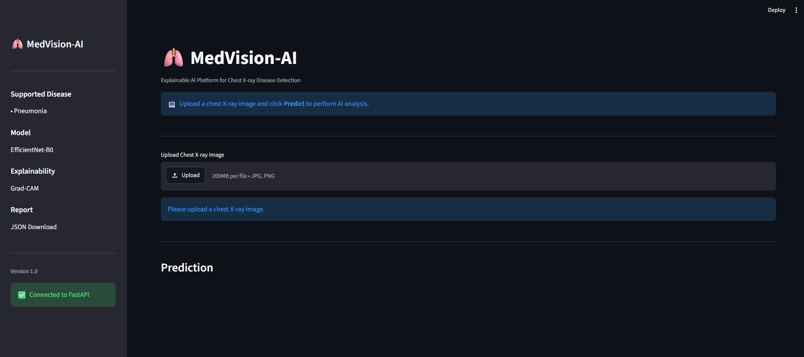
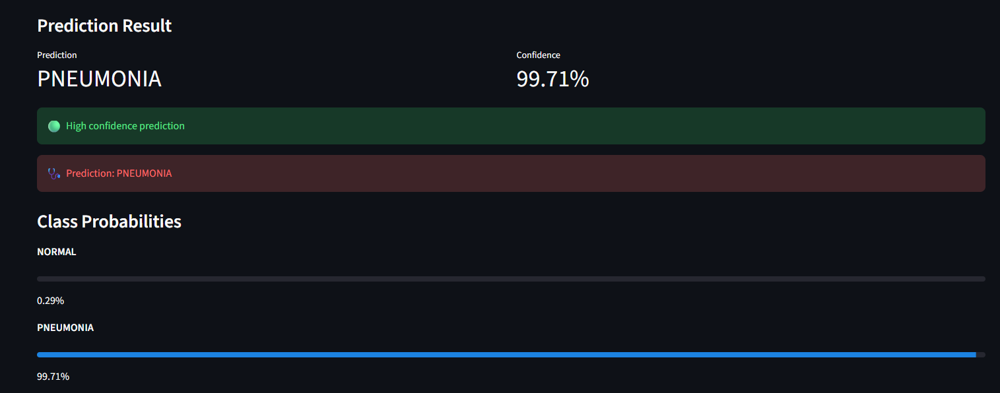
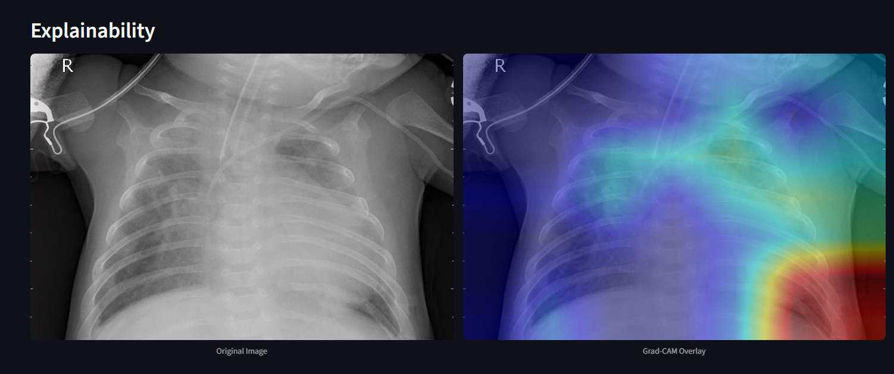
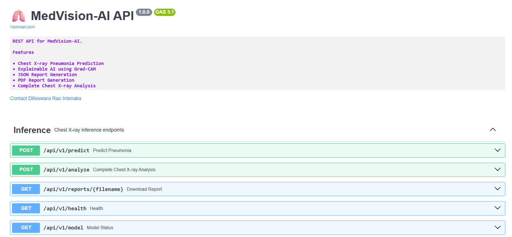
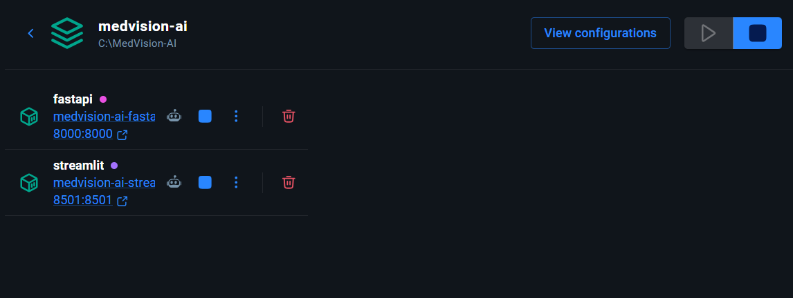
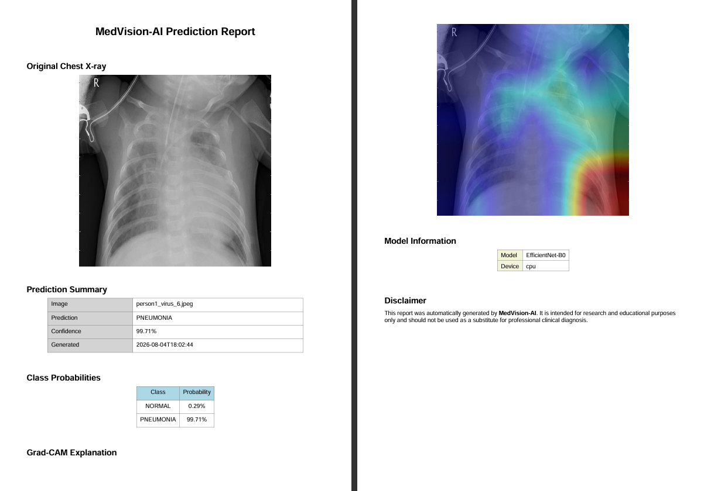

# 🫁 MedVision-AI

> **Explainable AI Platform for Chest X-ray Analysis**

An end-to-end explainable AI platform for automated pneumonia detection from chest X-ray images using EfficientNet-B0, Grad-CAM visualization, and an interactive Streamlit web application.

---

## 📖 Overview

MedVision-AI is a modular deep learning application that demonstrates Explainable Artificial Intelligence (XAI) for chest X-ray analysis. The platform integrates image preprocessing, EfficientNet-B0-based classification, Grad-CAM explainability, structured report generation, and an interactive Streamlit interface into a unified workflow.

The primary objective of the project is to demonstrate how modern deep learning models can be combined with explainability techniques to create transparent, interpretable, and user-friendly AI systems for medical imaging. Designed with a modular software architecture, the project supports future extensions such as REST APIs, Docker deployment, and multi-disease classification, making it suitable for research, education, and portfolio demonstration.

## ✨ Features

| Feature | Description |
|----------|-------------|
| 🫁 Chest X-ray Classification | Automated pneumonia detection using EfficientNet-B0 |
| 🔍 Explainable AI | Grad-CAM visualization highlighting important image regions |
| 📊 Confidence Scores | Displays prediction confidence and class probabilities |
| 📄 PDF Report Generation | Generates downloadable professional prediction reports |
| 📁 JSON Report Export | Structured prediction results in JSON format |
| 🖥️ Interactive Web Interface | User-friendly Streamlit application |
| 🧩 Modular Architecture | Separate modules for preprocessing, inference, explainability, and reporting |
| ⚡ GPU Support | CUDA acceleration for inference when available |
| 🔄 Reusable Pipeline | Designed for integration with Streamlit, FastAPI, and future deployment |


## 🏗️ Project Architecture

```text
                             User
                              │
                              ▼
                      Streamlit Frontend
                              │
                    REST API (HTTP Requests)
                              │
                              ▼
                      FastAPI Backend
      ┌──────────────┬──────────────┬──────────────┐
      │              │              │              │
      ▼              ▼              ▼              ▼
  EfficientNet-B0   Grad-CAM      SQLite     PDF/JSON Report
      │              │              │              │
      └──────────────┴──────────────┴──────────────┘
                              │
                              ▼
                    Results Returned to UI
```


### Workflow

### Workflow

1. The user uploads a chest X-ray image through the Streamlit web interface.
2. Streamlit sends the image to the FastAPI backend via a REST API.
3. FastAPI preprocesses the image and performs inference using EfficientNet-B0.
4. Grad-CAM generates an explainability heatmap highlighting important image regions.
5. FastAPI generates structured JSON and PDF reports and stores prediction metadata in SQLite.
6. The backend returns the prediction results, report information, and image paths to Streamlit.
7. Streamlit displays the prediction, confidence scores, Grad-CAM visualization, and provides report downloads.

## 📂 Project Structure

```text
MedVision-AI/
│
├── app/                            # Core application modules
│   ├── api/                        # FastAPI backend
│   ├── database/                   # Database utilities
│   ├── evaluation/                 # Model evaluation metrics
│   ├── explainability/             # Grad-CAM implementation
│   ├── inference/                  # Model loading and prediction
│   ├── models/                     # EfficientNet-B0 architecture
│   ├── preprocessing/              # Image preprocessing pipeline
│   ├── reporting/                  # JSON & PDF report generation
│   ├── training/                   # Model training pipeline
│   ├── utils/                      # Common utility functions
│   ├── config.py                   # Global configuration
│   └── __init__.py
│
├── checkpoints/                    # Trained model and training history
│   ├── best_model.pth
│   └── training_history.json
│
├── configs/                        # YAML configuration files
│   ├── app_config.yaml
│   ├── config.yaml
│   └── model_config.yaml
│
├── dataset/                        # Chest X-ray dataset
│   └── chest_xray/
│
├── docs/                           # Project documentation
│
│
├── notebooks/                      # Development & experimentation notebooks
│   ├── Dataset Understanding
│   ├── Dataset Analysis
│   ├── Image Preprocessing
│   ├── Dataloader Pipeline
│   ├── EfficientNet Implementation
│   ├── Training Pipeline
│   ├── Model Evaluation
│   ├── Grad-CAM Explainability
│   └── Batch Explainability Validation
│
├── outputs/                        # Generated outputs and visualizations
│   ├── predictions/
│   ├── reports/
│   ├── explainability/
│   ├── gradcam/
│   ├── heatmaps/
│   ├── visualizations/
│   └── batch_reports/
│
├── reports/                        # Generated PDF reports
│
├── scripts/                        # Testing scripts
│   ├── test_inference.py
│   ├── test_gradcam.py
│   └── test_reporting.py
│
├── streamlit_app.py                # Main Streamlit application
├── requirements.txt                # Project dependencies
├── README.md
├── Dockerfile.api
├── Dockerfile.streamlit
├── docker-compose.yml
├── requirements-docker.txt
└── .gitignore
```

## 📊 Dataset

MedVision-AI is trained and evaluated using the **Chest X-ray Images (Pneumonia)** dataset, a publicly available benchmark dataset hosted on Kaggle. The dataset contains pediatric chest X-ray images categorized into **Normal** and **Pneumonia** classes and is widely used for research in automated pneumonia detection.

### Dataset Source

- **Name:** Chest X-ray Images (Pneumonia)
- **Source:** Kaggle
- **Link:** https://www.kaggle.com/datasets/paultimothymooney/chest-xray-pneumonia

### Dataset Statistics

| Category | Images |
|----------|-------:|
| Normal | 1,583 |
| Pneumonia | 4,273 |
| **Total** | **5,856** |

### Dataset Split

| Split | Normal | Pneumonia | Total |
|------|-------:|----------:|------:|
| Training | 1,341 | 3,875 | 5,216 |
| Validation | 8 | 8 | 16 |
| Testing | 234 | 390 | 624 |

> **Note:** The original validation set provided with the dataset contains only 16 images. For robust model development, users may consider creating a larger validation split from the training data.

### Directory Structure

```text
dataset/
└── chest_xray/
    ├── train/
    │   ├── NORMAL/
    │   └── PNEUMONIA/
    │
    ├── val/
    │   ├── NORMAL/
    │   └── PNEUMONIA/
    │
    └── test/
        ├── NORMAL/
        └── PNEUMONIA/
```

### Data Characteristics

- **Imaging Modality:** Chest X-ray (Posterior-Anterior and Anterior-Posterior views)
- **Classification Task:** Binary Classification
- **Classes:**
  - ✅ Normal
  - 🩺 Pneumonia
- **Image Format:** JPEG (.jpeg)
- **Framework Compatibility:** PyTorch `ImageFolder`

### Dataset Availability

The dataset is **not included** in this repository due to its size and Kaggle licensing requirements. Please download it directly from the official Kaggle page and place it in the following directory:

```text
dataset/chest_xray/
```

After downloading, ensure the folder structure matches the layout shown above before training or running inference.

# 🛠️ Tech Stack

| Category | Technologies |
|-----------|--------------|
| Programming Language | Python 3.11 |
| Deep Learning | PyTorch, Torchvision |
| Computer Vision | OpenCV, Pillow |
| Explainable AI | Grad-CAM |
| Web Framework | FastAPI |
| Frontend | Streamlit |
| Database | SQLite |
| Report Generation | ReportLab, JSON |
| Image Processing | Albumentations |
| API Documentation | Swagger (OpenAPI) |
| Containerization | Docker, Docker Compose |
| Version Control | Git, GitHub |

# 🌐 REST API

### Local Base URL

http://localhost:8000/api/v1

> Once deployed, replace this with the public API URL.

| Method | Endpoint | Description |
|---------|----------|-------------|
| POST | /predict | Predict pneumonia |
| POST | /analyze | Complete AI analysis |
| GET | /history | View prediction history |
| GET | /history/{id} | Prediction details |
| DELETE | /history/{id} | Delete prediction |
| GET | /reports/{filename} | Download PDF |
| GET | /images/{filename} | View Grad-CAM |
| GET | /model | Model information |
| GET | /health | Health check |

# 🐳 Docker

### Build Images

```bash
docker compose build
```

### Start Services

```bash
docker compose up
```

### Stop Services

```bash
docker compose down
```

### Access the Applications

| Service | URL |
|----------|-----|
| Streamlit | http://localhost:8501 |
| FastAPI | http://localhost:8000 |
| Swagger UI | http://localhost:8000/docs |


# ⚙️ Local Installation

## Clone Repository

```bash
git clone https://github.com/Dilles97bme/MedVision-AI.git
cd MedVision-AI
```

## Create Virtual Environment

```bash
python -m venv .venv
```

## Install Dependencies

```bash
pip install -r requirements.txt
```

## Run FastAPI

```bash
uvicorn app.api.main:app --reload
```

## Run Streamlit

```bash
streamlit run streamlit_app.py
```


---

# 📷 Screenshots

### Home Page



### Prediction



### Grad-CAM Visualization



### Swagger UI



## Docker Containers



### PDF Report



---


# 🚀 Future Work

- Multi-class chest disease classification
- DICOM image support
- User authentication
- PostgreSQL integration
- Cloud deployment
- CI/CD pipeline
- Batch inference
- Model monitoring
- Multi-user support
- Model versioning

# 📄 License

This project is released under the MIT License.

# 🙏 Acknowledgements

- PyTorch
- FastAPI
- Streamlit
- Grad-CAM
- OpenCV
- Kaggle Chest X-ray Dataset


## 👤 Author

**Dilleswara Rao Intenaka**

- GitHub: https://github.com/Dilles97bme
- LinkedIn: https://www.linkedin.com/in/dilleswararaointenaka/
- Email: dilles97bme@mail.com